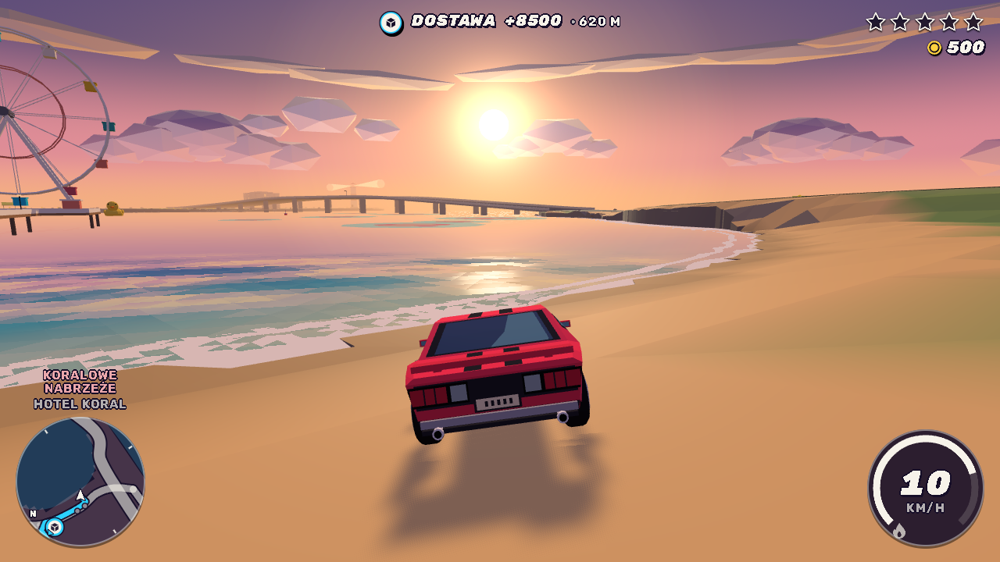
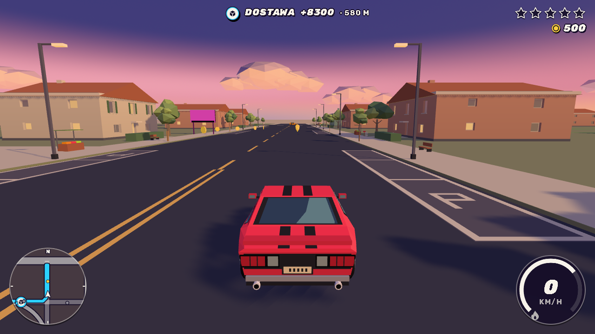
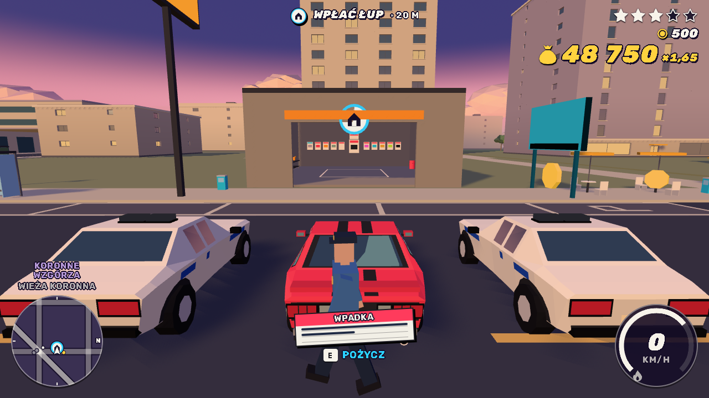

# Untitled Driving Game

An open-world arcade driving game that runs in the browser. You are the getaway driver who never keeps a car: steal it, wreck it, swap it, lose the police and bank the take.



| | |
|---|---|
|  |  |

## Features

- **One seamless island.** Four districts, each with its own character: Crown Heights on the hill, the industrial Sunset Works, the leafy streets of Palm Gardens and the beaches, quay and stadium of Coral Quay. The coast, the main roads and the landmarks are laid out by hand; the side streets, lots, buildings and props are generated from a seed.
- **Always behind the wheel.** Seven vehicle classes, from a compact and a muscle car to a heavy van, an off-roader and a motorbike. Drive up beside any car and take it.
- **A run with stakes.** Crimes fill your bag. The police only react to what they actually see, and the heat escalates from patrols to roadblocks to a helicopter with a searchlight. Reach one of three garages to bank the bag at your wanted multiplier, or get boxed in and lose half of it.
- **Jobs all over the map.** Getaway deliveries, steal-to-order, pursuit escapes, time trials, street races and rival duels, takedown rampages, mayhem zones and taxi fares.
- **Driving that pays.** Near misses, drifts, jumps and oncoming-lane runs chain into a combo. Billboards to smash, ramps to find, daily challenges and a hidden car.
- **The garage.** Buy cars, paint them and fit upgrades between runs.
- **Physics-driven handling.** Every car is a rigid body with real suspension, gearing and grip. Collisions dent the bodywork.
- **No asset downloads.** Every model, the sky, the sea and all audio, including the music, are generated in code at runtime. The whole game starts from a few megabytes of JavaScript.
- **Polish and English.** The interface is in Polish by default; English is one row away in the settings.

## Controls

| Key | Action |
|---|---|
| `W` `A` `S` `D` / arrow keys | Drive and steer |
| `Space` | Handbrake (drift) |
| `Shift` | Boost |
| `E` | Take the car beside you |
| `H` | Horn |
| `R` | Reset the car / respawn when wrecked |
| `C` | Camera |
| `Tab` (hold) | Map of the island |
| `P` | Pause and settings |
| `M` | Mute |
| `N` / `Enter` | Skip |

Keys follow their physical position, so WASD works on AZERTY and QWERTZ layouts without remapping. In the garage `A` and `D` move between pages, `W` opens one or drives out, `S` backs out; every screen is clickable too.

## Getting started

Requires [Node.js](https://nodejs.org/) 22 or newer.

```bash
npm install
npm start
```

`npm start` builds the production bundle and serves it at <http://localhost:4173>. Progress is saved in the browser; open <http://localhost:4173/?fresh=1> to start a new profile, or add `?lang=en` for English.

For development with live reload:

```bash
npm run dev
```

The dev server runs at <http://localhost:5173>. Debug URLs, test spawns and the live tuning panel (`` ` ``) are described in [docs/DEV.md](docs/DEV.md).

## Tech stack

- **TypeScript**, built with **Vite**
- **Three.js** for rendering: low-poly and flat-shaded, with a dynamic sky, fog and tone mapping
- **Rapier** (WebAssembly) for vehicle and world physics
- **Web Audio** for the synthesized engine, sirens, effects and music
- **Vitest** for simulation tests, **Playwright** for end-to-end, screenshot and performance tests

## Architecture

The game is split into a headless simulation and the layers that read it:

```
src/
  sim/        game state and physics on a fixed 60 Hz step; no DOM, no Three.js
  render/     Three.js scene, interpolated between simulation steps
  audio/      engine, effects and music synthesis
  ui/         HUD, map, garage and menus; localisation
  input/      devices mapped to abstract actions
  platform/   platform abstraction (saves, lifecycle events)
  app/        the loop and the glue between the layers
```

The layering is enforced by lint rules: the simulation can run, and is tested, entirely in Node. The island is baked from its plan at build time. More detail, including the design decisions behind it, is in [docs/ARCHITECTURE.md](docs/ARCHITECTURE.md).

## Testing

```bash
npm run verify        # typecheck, lint, simulation tests, build, smoke test, size budget
npm run verify:gate   # the above plus the long bot-driven tests
npm run perf          # frame-time measurement with an autopilot under CPU throttling
```

The build fails if it exceeds its size budget (startup download, total size and file count).

## Credits

Interface typeface: [Rubik](https://github.com/googlefonts/rubik), SIL Open Font License 1.1. Everything else in the game is original and generated in code; see [docs/ASSETS.md](docs/ASSETS.md).

## License

© 2026 Marcin. All rights reserved.
